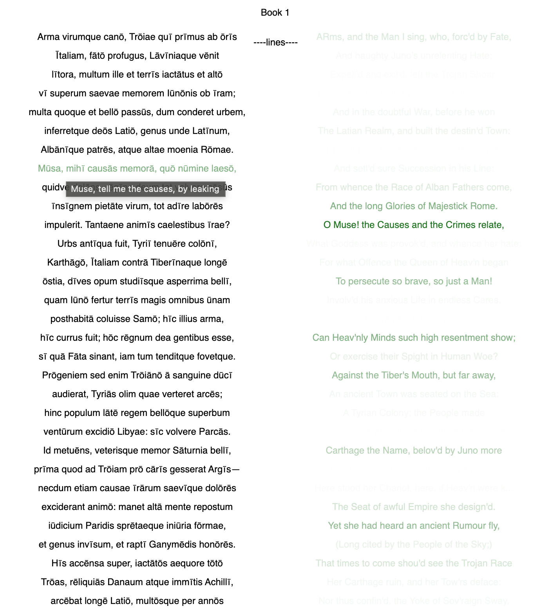
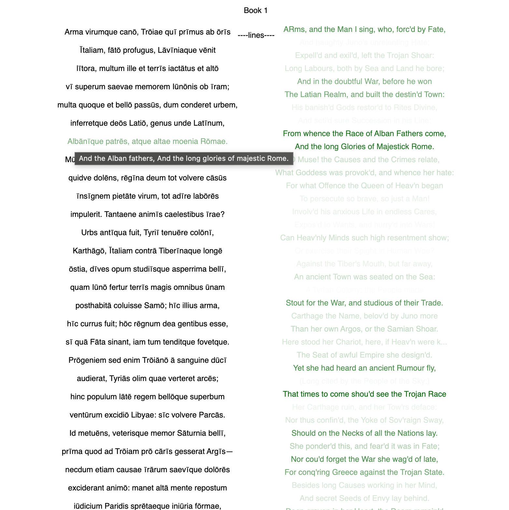
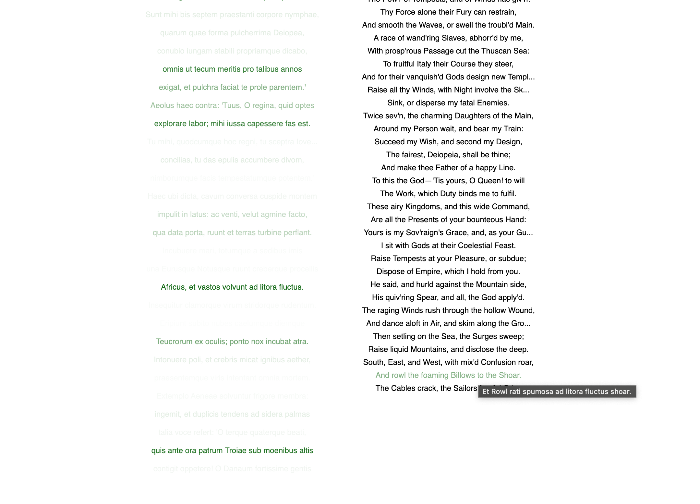

# guess-dryden
a visual exploration of the relationship between literary and machine translation

Try it here: https://yl-z.github.io/guess-dryden/

Taking parts of the Aeneid (in [Latin](http://www.thelatinlibrary.com/verg.html) and [Dryden's highly literary English](https://quod.lib.umich.edu/cgi/t/text/text-idx?c=eebo;idno=A65112.0001.001)), lines are matched with the help of Google Translate. Having translated each line to the opposite language, a token-based string distance is computed and shown as dark to light values (darkest meaning closest). Hover over the lines to view this as well as the intermediary machine translated line. 

Currently, the data is pretty noisy, but some lines are showing promise:

## Next Steps
- add a prior based on the place in the text (e.g. a rolling window)
- link a dictionary, thesaurus, or other lexicon instead of Google translate
- clean up the data processing steps so different texts can be quickly compared